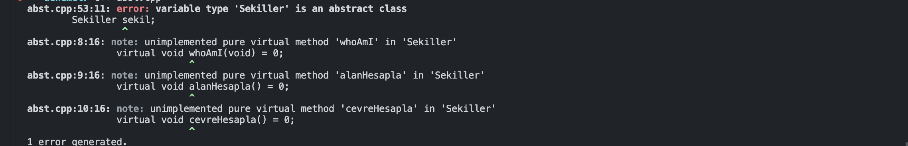

# C++ : Abstract Class

Şimdi yaptığımız kedigiller sınıfını örnek alalım. 

Kedigiller base sınıftı demi? Her şey onu miras alıyordu ve Kedigiller tek başına bize bir şeyi temsil etmiyordu. 

Kedigiller çünkü çoğul biz onu nesne olarak alıp kullanmamız mantıklı değil bunun yerine onu miras alan kedi/aslan/çita sınıflarını kullanmak daha mantıklı.

 Biz kedigiller sınıfını hepsini bir arada kullanabileceğimiz (polymorphism) için arayüz olarak kullanmıştık. (Kafanız birazcık karıştı biliyorum ama sakin ol.)

Şimdi bir şekilleri sınıflandırıcağımız bir sınıf oluşturucağımızı düşünelim. (Kare/Dikdörtgen/Daire vb.). Bunlarım ana özellikleri nelerdir?

- Şekil olmaları xd
- Alanları olması
- Çevresi olması vb. (Daha fazla şeyler eklebilir ama konumuz  matematikte şekiller değil.)

O zaman bunların hepsin de bir 

int alan;

int çevre;

Yazamayız mantılı değil çünkü  inheritance diye bir şey öğrendik. Ancak her bir şekilin kendine göre 

- Yükseliği
- Kenar uzunluğu
    - Kısa kenar
    - Uzun Kenar

Özellikleri var. Mesela dairenin kenarı yok yarı çapı var gibi. Bu yüzden nasıl bir Class şeması çıkartabiliriz?

1. Şekiller adında bir ana base sınıfımız olur.
    1. İçinde alan ve çevre değişken üyeleri olur.
2. Diğer oluşturacağımız dikdörtgen/daire vb. ise bu şekiller sınıfını miras alarak türetiriz. Hepsinin kendi constructorlarında kenar/yükseklik/yarı çapı uzunluklarını alırız.

Hadi o zaman yapalım.

```cpp
#include <iostream>

class Sekiller{
	protected:
		int alan;
		int cevre;
	public:
		virtual void whoAmI(void){
			std::cout << "Ben Base Sekillerim" << std::endl;
		}
};

class Dikdörtgen : public Sekiller{
	public:
		void whoAmI(void){
			std::cout << "Ben Dikdörtgenim." << std::endl;
		}	
};
class Daire : public Sekiller{
	public:
};

int main(){
	Sekiller *b[3];
	b[0] = new Sekiller(); 
	b[1] = new Dikdörtgen();
	b[2] = new Daire(); 

	b[0]->whoAmI();
	b[1]->whoAmI();
	b[2]->whoAmI();
}

```

Şimdi burada gördüğünüz gibi daire haricinde hepsinin kendinin hangi şekil olduğunu söyleyen bir method var.

Böyle bir durumda Daire sınıfı şekiller sınıfının whoAmI methodunu kullanır. Bu da burada yanlış bir durumdur. Şimdi burada eğer bir sınıfı bu şekilde hepsinde olmasını istediğimiz özellikleri topluyorsak bu sınıfı abstract class yaparız. Gelin Sekiller sınıfını abstract bir sınıf yapalım.

 

```cpp
class Sekiller{
	protected:
		int alan;
		int cevre;
	public:
		virtual void whoAmI(void) = 0; //pure method olarak da adlandırılır.
};
```

O sınfa ait hanallaştırılmış erhangi bir methodun gövdesini silip “=0” yazarsak bu sınıf artık abstract sınıf olarak geçmeye başlar.

- **Abstract sınıfın diğer sınıflardan farkları nelerdir ?** (Kenarda ki oka basarak açılabilir listeyi okuyabilirsin.)
    - **Soyut (Abstract) Fonksiyonlar:**
        - Abstract sınıflar içinde en az bir tane saf sanal (pure virtual) (”=0” olarak eşitlenen methodlar) fonksiyon bulunmalıdır.
        - Saf sanal fonksiyonlar, sınıfın alt sınıfları tarafından mutlaka yeniden tanımlanmalıdır.
        - Bu fonksiyonlar sadece imza (isim ve parametre listesi) sağlar ve hiçbir somut (concrete) implementasyon içermez.
    - **Nesne Oluşturulamaz:**
        - Abstract sınıflardan doğrudan nesne oluşturulamaz. Yani, bir abstract sınıftan bir nesne oluşturamazsınız.
        - Abstract sınıflar genellikle diğer sınıflar için bir temel (base) sınıf olarak kullanılır ve bu sınıflardan türetilen alt sınıflar üzerinden nesne oluşturulur.
    - **Polimorfizmi Destekler:**
        - Abstract sınıflar, polimorfizmin bir aracı olarak kullanılır.
        - Saf sanal fonksiyonlar sayesinde, abstract sınıflardan türetilen farklı sınıfların aynı arayüzü paylaşması sağlanır ve bu sınıfların farklı davranışlar sergilemesi mümkün hale gelir.
    - **Temel Sınıf Olarak Kullanılır:**
        - Abstract sınıflar genellikle genel davranışları tanımlamak için kullanılır ve bu davranışlar alt sınıflar tarafından özelleştirilir.
        - Diğer sınıflar, abstract sınıflardan türetilerek bu davranışları kalıtım yoluyla alır ve ihtiyaç duydukları özellikleri eklerler.
    - **Somut Veri Üyeleri Olabilir:**
        - Abstract sınıflar somut veri üyelerine (non-static member variables) sahip olabilirler.
        
        ```cpp
        	protected:
        		int alan;
        		int cevre;
        ```
        
        - Bu veri üyeleri, abstract sınıfın alt sınıfları tarafından da kullanılabilir ve bu alt sınıflar tarafından gerekli durumlarda değiştirilebilir veya genişletilebilir.

Şimdi yukarıda ki örneğimizi detaylandıralım.

```cpp
#include <iostream>

class Sekiller{
	protected:
		double alan;
		double cevre;
	public:
		virtual void whoAmI(void) = 0;
		virtual void alanHesapla() = 0;
		virtual void cevreHesapla() = 0;

		double getAlan()const{
			return alan;
		}
		double getCevre()const{
			return cevre;
		}
};

class Dikdörtgen : public Sekiller{
	private:
		double yukseklik;
		double genislik;
	public:
		Dikdörtgen(double yuk, double gen) : yukseklik(yuk), genislik(gen){}
		void whoAmI(void){
			std::cout << "Ben Dikdörtgenim." << std::endl;
		}
		void alanHesapla(){
			alan = yukseklik * genislik;
		}
		void cevreHesapla(){
			cevre = 2 * (yukseklik + genislik);
		}
};
class Daire : public Sekiller{
	private:
		double yariCap;
	public:
		Daire(double r) : yariCap(r){}
		void whoAmI(void){
			std::cout << "Ben Daireyim." << std::endl;
		}
		void alanHesapla(){
			alan = yariCap * yariCap * 3.14;
		}
		void cevreHesapla(){
			cevre = 2 * 3.14  * yariCap ;
		}
};

int main(){
	Sekiller *b[2];
	b[0] = new Dikdörtgen(10,20);
	b[1] = new Daire(10); 

	for(int i = 0 ; i < 2 ; i++ ){
		b[i]->alanHesapla();
		b[i]->cevreHesapla();
		b[i]->whoAmI();
		std::cout << "Alanım : " << b[i]->getAlan() << " | Çevrem : " << b[i]->getCevre() << std::endl;
	}
}

```

Burada Sekiller sınıfımızı pure methodlarımızla Abstract sınıf olarak belirledik. Dikdörtgen ve Daire sınfınlarını sekiller sınıfından miras alıcak şekilde yazdık. Bu sayede whoAmI, alanHesapla ve cevreHesapla methodları tanımlanmak zorunda kaldı.

Main de sekiller sınıfını arayüz olarak kullanıp polymorphism base sınıfı olarak kullanmış olduk.

Sekiller sınıfı içerisinde “alan ve çevre” tanımlayarak abstract sınıflardan da somut veri üyeleri kullanım örneğini kullanmış olduk.

Daha iyi ve net anlamak için örneği bir “.cpp” dosyasında çalıştırarak üstünde oynama yaparak nasıl sonuçlar alabileceğinizi görmektir. Mesela sekiller sınıfından bir nesne üretmeye çalışarak şu hatayı görebilirisniz.

