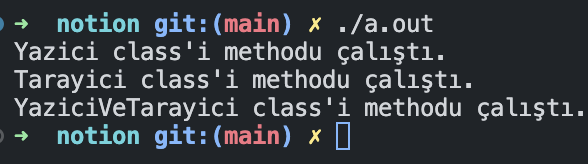

# C++ : Multiple Inheritance

Şimdi şu ana kadar normal tekli bir şekilde kalıtım almayı gördük. Ancak şuan gördüğümüz şey her dilde izin verilen bir şey değildir. Kullandığınız dil içerisinde çoklu kalıtıma izin veriyor mu vermiyor mu bakmanız gerekiyor. C++ buna izin veriyor ancak bazı sıkıntılar yaşayabiliyorsunuz. Bunun başlıca sorunlarında Diamond Problemi gelmektedir. Bunun çözümleri var ancak çok onaylanan bir şey olmadığı için mesela C# da çoklu kalıtım yoktur. 

Şimdi konuya geçelim.

```cpp
class Template : public InheritanceClass{
}
```

Biliyorsunuz ki normal bir tane mirası bu şekilde alıyoruz.  Multiple miras alırken ise şu şekilde yazıyoruz.

```cpp
class Template : public InheritanceClass, public MultipleInheritance{
}
```

Bu şekilde birden çok sınıfı miras alan bir Template türemiş sınıfı oluşturuyoruz. 

Bu ne işe yarıyor?

- Bunun olayı iki tane taban(base) sınıf alaraktan ikisininde özelliklerini ve methodlarını kullanmaktır. Buna ihtiyaç duyduğunuz durumlar olabilir. Buna nasıl bir örnek verebiliriz?
    - Mesela iki tane base sınıfım vardır biri savunma biri atak yapmak için ve bir karakter sınıfı oluşturduğumda bu iki sınıfı miras almak mantıklı olucaktır. (Bunun için daha çok abstract class kullanmak daha mantıklı ama şimdilik böyle bir örnek verelim.)

Şimdi kendi kod örneğimize geçelim basit bir şekilde kodlanmasını ve nasıl çalıştığını görebilmek için.

```cpp
#include <iostream>
using namespace std;

class Yazici{
    public :
        Yazici(){
            cout << "Yazici class'i methodu çalıştı." << endl;
        }
};

class Tarayici{
    public :
        Tarayici(){
            cout << "Tarayici class'i methodu çalıştı." << endl;
        }
};

class YaziciVeTarayici : public Yazici, public Tarayici {
    public:
        YaziciVeTarayici(){
            cout << "YaziciVeTarayici class'i methodu çalıştı." << endl;
        }
};

int main(){
    YaziciVeTarayici a;
}
```



Burada gördüğünüz gibi YaziciVeTarayici sınıfını ürettiğimizde Yazici ve Tarayici sınıfının default c*onstructor çalışıcaktır. Çünkü iksinide miras olarak aldığı için böyle bir durum gerçekleşiyor.*

Şimdi işleri biraz karıştıralım

```cpp
#include <iostream>
using namespace std;

class Yazici{
    private:
        string yaziciName;
    public :
        Yazici(string yaziciName) : yaziciName(yaziciName){
            cout << "Yazici class'i methodu çalıştı." << endl;
        }
        string getNameY(){return yaziciName;}
};

class Tarayici{
    private :
        string tarayiciName;
    public :
        Tarayici(string tarayiciName) : tarayiciName(tarayiciName){
            cout << "Tarayici class'i methodu çalıştı." << endl;
        }
        string getNameT(){return tarayiciName;}
};

class YaziciVeTarayici : public Yazici, public Tarayici {
    public:
        YaziciVeTarayici(string n1, string n2): Tarayici(n1), Yazici(n2){
            cout << "YaziciVeTarayici class'i methodu çalıştı." << endl;
        }
};

int main(){
    YaziciVeTarayici a("Choreme", "Vestel");
    cout << "Tarayici ismi : " << a.getNameT() << "\nYazici İsmi : " << a.getNameY() << endl;
}
```

Artık Yazici ve Tarayici sınıflarımızın bir üyesi var. İkisinede daha önce edindiğimiz (base class constructor call) bilgileri kullanarak atama işlemlerini yaptık. Bunları nasıl main’de kullanıcağız ?

Bunun için iki yöntem var birincisi benim yukarıda yazdığım.

```cpp
int main(){
    YaziciVeTarayici a("Choreme", "Vestel");
    cout << "Tarayici ismi : " << a.getNameT() << "\nYazici İsmi : " << a.getNameY() << endl;
}
```

Burada getNameT ve getNameY adında iki tane get methodumu kullanarak üyeleri ekrana yazdırıyorum ancak şöyle bir durum var ikisinin de ismi getName() olsaydı program nasıl anlayacaktı ? Anlamıcaktı.


Bu durumda şu şekilde bir çağırma yapardık. 

```cpp
int main(){
    YaziciVeTarayici a("Choreme", "Vestel");
    cout << "Tarayici ismi : " << a.Tarayici::getName() << "\nYazici İsmi : " << a.Yazici::getName() << endl;
}
```

Method adları değişik olsa dahi bir den fazla miras alındığında hangi sınıfın methodunu çağırıyorsak bu şekilde kullanmak daha okunaklı ve daha doğru bir tercihtir. (İleride tek başına kod yazmıcaksın bu yüzden bu tür durumları önemini anlaman gerekiyor.)