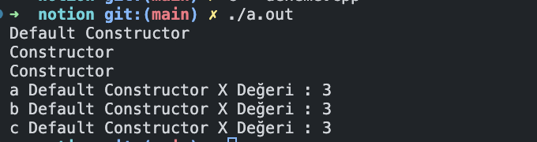

# C++ : Statik

C dilinde olduğu gibi statik değikenler aynı mantıkta C++’da çalışıyor ancak sadece class içerisinde kullanımında bir farklılık var.

1. Bir class içerisinde static bir değişken veya method tanımlandıysa bu methodu/değişkeni nesne olmadan çağırabilir veya kullanabiliriz.
2. Class içerisinde static değişken tanımladığımızda o classtan oluşturacağımız tüm nesneler aynı değişkeni kullanır.
    1. Bunun nedeni static değişkenler program derlenirken oluşturulur ve tüm program boyunca bir kez tanımlanır. Bu yüzden tüm nesneler aynı değişkene ulaşır. Normal tanımladığımız değişkenler scope’lar içerisinde ilk açıldığında tanımlanır ve scope kapanırken kendiside ramden tuttuğu alan bırakılır.
3. Class içerisinde kullandığımız static değişkenler public’se direk ulaşabiliriz ancak eğer private bir static değişkenimiz varsa setter/getter methodlarımızda static olması gerekmektedir.
    1. Çünkü static değişkenler program başlarken oluşturulduğu için static olmayan bir getter methodu oluşturduğumuz değere ulaşamıcak veya setter atama yapmayacaktır. Statik olarak tanımlarsak methotlarda program başında tanımlancağından ötürü ulaşabileceğiz. Bir sıkıntı yaşamayacağız.

<aside>
💡 Static değişkenler program başlarken tanımladığı için default atamalarını Constructorlar içerisinde atamayız. Bu yüzden main’in olduğu cpp dosyamızın başında bu şekilde tanımlıyoruz. Private değere ulaşamıyoruz nasıl böyle bir tanım olucak derseniz? İlk atama sırasında değişkenimiz private da olsa bu şekilde erişebiliyoruz ve ilk atamasını gerçekleştirebiliyoruz ancak daha sonrasında tekrar denerseniz hata alırsınız. Sadece ilk atamaya özel bir durum.

```cpp
int kare::publicCount = 0;
int kare::privateCount = 0;
```

</aside>

Şimdi az çok anladığınızı düşünüyorum.  Şimdi örnekler üzerinden anlatarak pekiştirelim.

```cpp
 #include <iostream>
    using namespace std;
    
    class kare {
    	private:
    		int x;
			static int privateCount;
			// şimdi bu private static değişkenimiz.
    	public:
			static int publicCount;
			// bu da public static değişkenimiz
    		kare(); 
    		kare(int x); 
    };

	kare::kare(){
		cout << "Default Constructor" << endl;
	}

	kare::kare(int x){
		this->x = x;
		cout << "Constructor" << endl;
	}

//kare.hpp dosyamız.
```

```cpp
//main.cpp dosyamız.

#include "kare.hpp"

int kare::publicCount = 0;
int kare::privateCount = 0;

kare::kare(){
	this->privateCount++;
	this->publicCount++;
	cout << "Default Constructor" << endl;
}

kare::kare(int x){
	this->privateCount++;
	this->publicCount++;
	this->x = x;
	cout << "Constructor" << endl;
}

int kare::get_x(){
	return privateCount;
}

int main(){
	int value = 10;

	kare a;
	kare b(5);
	kare c(value);
	
	cout << "a Default Constructor X Değeri : " << kare::publicCount << endl;
	cout << "b Default Constructor X Değeri : " << kare::get_x() << endl;
	cout << "c Default Constructor X Değeri : " << c.get_x() << endl;
}
```

Program çıktısı :



Küçük ödev :

1. Şimdi gidip bir statik set methodu yazın.
2. C nesnesinden önce set methodu ile private değeri 500 olarak setleyin.
3. Sonuç ne oluyor bakalım 🙂